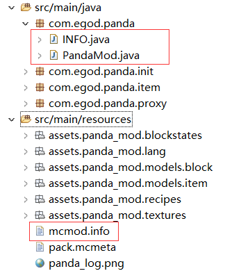
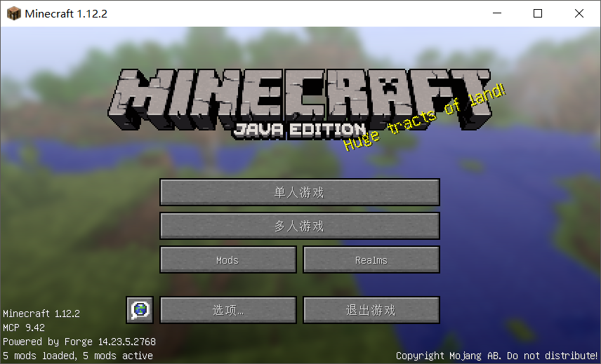
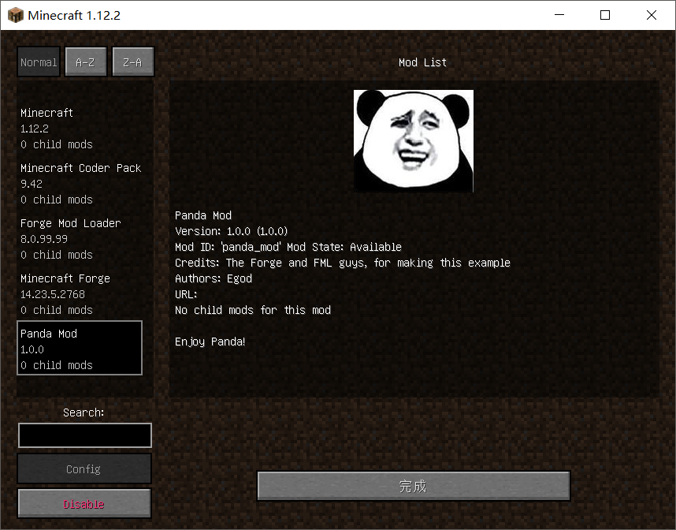

### 1. 让一个MOD运行起来的基本框架

打开eclipse后，在src/main/java(如果没有的话就自己建立这个路径)中建立一个入口包，以我的熊猫MOD为例，包名如下：
```
com.egod.panda
```
在此包下需要建立以下两个基本类和一个`.info`文件：
```
PandaMod.java
INFO.java
mcmod.info
```


其中`PandaMod.java`类定义了MOD的入口，利用FML的事件向游戏本体写入MOD所包含的物品、功能
```
@Mod(modid = INFO.MODID,name = INFO.NAME,version = INFO.VERSION)
public class PandaMod {
	
	@EventHandler
	public void preLoad(FMLPreInitializationEvent event){}

	@EventHandler
	public void load(FMLInitializationEvent event){}

	@EventHandler
	public void postLoad(FMLPostInitializationEvent event){}

}
```
此处的`@Mod`和`@EventHandler`都是java的一个特殊工具，叫做**标注**（Annotation）,可以简单的理解为标注某一个方法或者类从而
告诉MC本体，有`@Mod`标注的类是我的入口类，有`@EventHandler`标注的方法是我的一个事件处理函数。

方法`preLoad`，`load`，`postLoad`可以理解为游戏MOD加载的三个阶段，我们在不同的阶段会对游戏本体干一些不同的事情。
比如物品注册会在`preLoad`阶段进行，而物品的资源信息注册会在`load`阶段进行。

`INFO.MODID`**是啥？** 莫慌，`INFO.java`类是一个用来存储MOD信息的类，里面基本上只含有静态变量，可以理解为一个存储了MOD信息
的txt文件。
```
public class INFO {
	public static final String MODID = "panda_mod";
	public static final String NAME = "Panda Mod";
	public static final String VERSION = "1.0.0";
}
```
到此处，使用Eclipse进行Run,

进入游戏初始界面后，点击Mods并翻阅，可以看到一个名为 **Panda Mod** 的 Mod

嗯。。为什么有个熊猫头？ 因为这是熊猫MOD的LOGO，可以通过src/main/resources/mcmod.info进行设置。
```
[
{
  "modid": "panda_mod",
  "name": "Panda Mod",
  "description": "Enjoy Panda!",
  "version": "1.0.0",
  "mcversion": "any",
  "url": "",
  "updateUrl": "",
  "authorList": ["Egod"],
  "credits": "The Forge and FML guys, for making this example",
  "logoFile": "panda_log.png",
  "screenshots": [],
  "dependencies": []
}
]
```
注意到`"logFile"`这一栏填入了`"panda_log.png"`，而这个`panda_log.png`是与mcmod.info放在同一个目录下即可的。
此处送上`panda_log.png`


上一章：无

下一章：[2.创建一个方块：熊猫矿石（不包含在世界上生成）](../CPT2/CPT-2.md)
