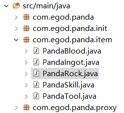
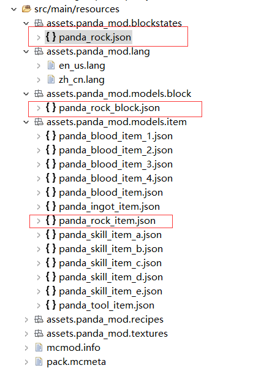
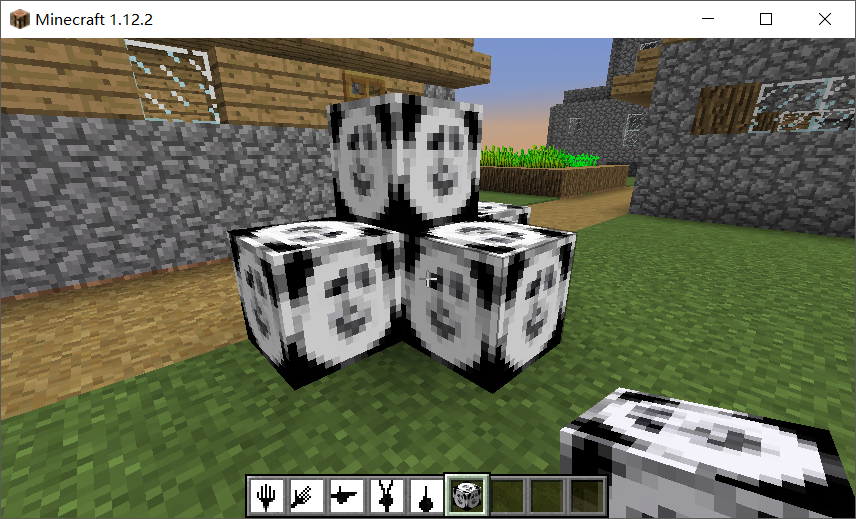
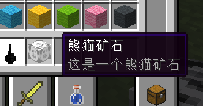
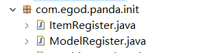
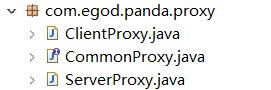
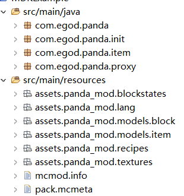

### 2. 创建一个方块：熊猫矿石（不包含在世界上生成）

这一章将会创造一个拥有熊猫贴图的方块，类似于游戏中的岩石方块，泥土方块

你将会增加使用如下工具
```
1. Phtoshop
2. 百度/搜狗
```
首先确定要建立的`.java`文件名为`PandaRock.java`，我把它叫作熊猫岩石。这个类继承了`net.minecraft.block`中的`Block`类，继承，往往是我们
代码简单的源头。
```
public class PandaRock extends Block{
    public PandaRock(){}
}
```


细心的人会发现，我在`com.egod.panda`包中建立了一个新的子包`item`用来存放我建立的物品类`PandaRock.java`，这仅仅是为了在文件多
了以后方便管理而已，你也完全可以把很多文件胡乱的放在一起。

现在它还什么都没有，接下来完善它的构造函数
```
// 为熊猫岩石设置一个静态属性——它的名字，并且会在下面用到
private static final String name = "panda_rock";

public PandaRock() {

  // 使用ROCK类材料的构造函数
  super(Material.ROCK); 
  
  // 将name作为熊猫岩石的注册名
  setRegistryName(name); 
  
  // 将"panda_mod:panda_rock_item"作为 Unlocalized Name
  setUnlocalizedName(INFO.MODID+":"+name+"_item"); 
  
  // 这一步照着做就行
  setCreativeTab(CreativeTabs.BUILDING_BLOCKS); 
  
  // 发光程度(0~1)
  setLightLevel(0.5f); 
  
  // 硬度
  setHardness(1.5f); 
  
  // 对爆炸的抵抗力
  setResistance(10.0f); 
  
  // 设置为只能用开采等级为1的 十字镐 进行挖掘
  setHarvestLevel("pickaxe", 1); 
  
  // 设置它的声音像 石头 
  setSoundType(SoundType.STONE); 
}
```
重点关注的是下面这两行代码
```
  setRegistryName(name); 
  
  setUnlocalizedName(INFO.MODID+":"+name+"_item"); 
```
`setRegistryName(name)`是将`name`作为注册名向MC进行注册，这一个名字将与之后用到的
`src/main/resources/assets/panda_mod/blockstates`中的`panda_rock.json`进行严格的命名匹配。

`setUnlocalizedName(INFO.MODID+":"+name+"_item"); `是将"panda_mod:panda_rock_item"作为熊猫岩石的 Unlocalized Name，
将与之后用到的`src/main/resources/assets/panda_mod/models/item`中的`panda_rock_item.json`进行
严格的命名匹配。

#### panda_rock.json
```
{
    "variants":{
        "normal":{"model":"panda_mod:panda_rock_block"}
    }
}
```
此处的`"model":"panda_mod:panda_rock_block"`表明，该方块的模型将使用`src/main/resources/assets/panda_mod/models/block`
目录下的`panda_rock_block.json`文件。
#### panda_rock_item.json
```
{
    "parent":"panda_mod:block/panda_rock_block"
}
```
此处的`"parent":"panda_mod:block/panda_rock_block"`表示，`panda_rock_item`模型继承`panda_rock_block`模型的属性。

注意到有一个名为`panda_rock_block`的东西，这也是一个.json文件，是用来表示熊猫岩石的方块模型的，而上面提到的`panda_rock_item.json`
则是用来表示熊猫岩石在物品栏中作为一个物品时的模型，对于方块来说，这两个是几乎一样的，所以在`panda_rock_item.json`中直接继承
`panda_rock_block.json`模型的属性就好。
#### panda_rock_block.json
```
{
    "parent": "block/cube_all",
    "textures": {
        "all":"panda_mod:panda_rock_texture"
    }
}
```
此处的`"textures"`关键词指明了材质文件相关信息，结合`"all"`关键词，告诉FML：在我的ID为`panda_mod`中一个注册名为`panda_rock`，
Unlocalized Name为`panda_mod:panda_rock_item`的方块，它使用的材质存放在`src/main/resources/assets/panda_mod/textures/`
中，名为`panda_rock_texture.png`，并且，我想要这个方块的六个面都是长得同一个样子。

送上熊猫贴图（16x16），原版限制，方块和物品贴图大小都为16x16像素


接下来介绍.lang文件。.lang文件是游戏所使用的语言文件，决定了你的物品在游戏中显示为什么名字以及它的更详细的信息
#### en_us.lang
```
tile.[MOD ID]:[物品的Unlocalized Name].name=你想要的名字

tile.panda_mod:panda_rock_item.name=Panda Rock
```
这里的前缀`tile.`是方块物品特有的，如果是普通的`item`，则其前缀为`item.`，如下一章将会创建的熊猫锭。注意在`=`号两侧不要添加空格。
```
item.panda_mod:panda_ingot_item.name=Panda Ingot
```
再配置一个中文版的语言文件
#### zh_cn.lang
```
tile.panda_mod:panda_rock_item.name=熊猫矿石
```
创建这个.lang文件时，注意`右键-Properties`，设置字符编码模式为utf-8，不然在游戏中会变成乱码

到这一步，这个方块已经基本成型了，效果图如下，但是你目前仍然不会有显示，因为还没有注册该物品


#### 注册物品(稍微复杂)
注册一个物品（方块）分为两步
* 使用物品名进行名义上的注册
* 使用Unlocalized Name对模型进行本地资源注册
通常来讲，我们所创建的物品（方块），在服务器端只需要创建一个示例就好（也就是一堆代码，没有图形），而在客户端，则对其进行渲染（也就是能看到图形）。

在新版本的Forge中，它推荐我们通过**注册事件**来进行物品注册。你可以理解为游戏开始时，很多游戏本体的物品会开始注册，而你就在此时搭乘顺风车把你创建
的物品也一起注册了。

先来创建一个ItemRegister类来帮助我们统一管理所有的物品进行名义上的注册已经创建实例。（可以的话，先创建一个`init`子包，将`ItemRegister.java`放在里面）
#### ItemRegister.java
```
@Mod.EventBusSubscriber(modid = INFO.MODID)
public class ItemRegister {
    // 创建PandaRock的一个实例
    public static final PandaRock pandaRock = new PandaRock();

    // 直接利用PandaRock实例创建在物品栏中熊猫岩石方块的实例
	public static final ItemBlock pandaRockItem = new ItemBlock(pandaRock);
    
    // 上事件注册的公交车，从而可以开始偷偷观察什么时候开始物品注册
    public ItemRegister() {
        MinecraftForge.EVENT_BUS.register(this);
    }
    
    // 注册方块，通过捕获Block的注册事件，顺便把熊猫岩石也注册了
    @SubscribeEvent
    public static void registerBlock(RegistryEvent.Register<Block> event) {
        event.getRegistry().registerAll(
                pandaRock
                );
    }

    // 注册物品，通过捕获Item的注册时间，顺便把熊猫岩石在物品栏中的物品也注册了
    @SubscribeEvent
    public static void registerItem(RegistryEvent.Register<Item> event) {
        pandaRockItem.setRegistryName(pandaRock.getRegistryName());
        event.getRegistry().registerAll(
                pandaRockItem,
                );
    }
}
```
第二步，创建一个ModelRegister类来帮助我们管理所有物品进行本地资源的注册（让他们能够以图形的方式给我们看）
#### ModelRegister
```
public class ModelRegister {
    
    // 搭公交车
    public ModelRegister() {
        MinecraftForge.EVENT_BUS.register(this);
    }
    
    // 注册本地资源模型，通过捕获 模型注册事件 ，顺便把熊猫岩石的模型也注册了
    @SubscribeEvent
    public void registerItemModels(ModelRegistryEvent event) {
        registerItemModel(ItemRegister.pandaRockItem);
        }
    }
    
    // 将注册手续格式化为一个方法，避免物品多了一个重复劳动
    // 此处item.getUnlocalizedName().replace("tile.", "").replace("item.", "") 用了两个replace是因为
    //   getUnlocalizedName()方法在返回时会加上前缀，而在src/main/resources中我的文件没有这个前缀，为了
    //   不报错，我手动去掉它
    private void registerItemModel(Item item) {
        ModelLoader.setCustomModelResourceLocation(item,0,
                        new ModelResourceLocation(
                        item.getUnlocalizedName().replace("tile.", "").replace("item.", ""),
                        "inventory"));
    ｝
}
```
然后你就可以直接（并不推荐）在`PandaMod.java`中调用这两个类了



```
@Mod(modid = INFO.MODID,name = INFO.NAME,version = INFO.VERSION)
public class PandaMod {
    
    @EventHandler
    public void preLoad(FMLPreInitializationEvent event)
    {
        new ItemRegister();
        new ModelRegister();
    }
     
    @EventHandler
    public void load(FMLInitializationEvent event)
    {	
    }
     
    @EventHandler
    public void postLoad(FMLPostInitializationEvent event)
    {
    }
}
```
这样做，你确实可以在游戏中看到它了，很多简单教程也会教你这么干，但是这样会浪费资源，因为你同时在服务器端和客户端创建了实例，注册了信息并注册了本地化资源，
也就是说你的服务器端也开始显示模型的图像，这毫无意义。

FML为你指明了正确的做法：使用端口代理（Proxy），在不同的端口做不同的事。比如，只在服务器端进行名义上的注册和创建物品实例，只在客户端对物品进行图形建模和渲染。



首先创建一个Proxy公共接口，它规定了一个Proxy应该有哪些方法
#### CommonProxy.java
```
public interface CommonProxy {
	
    abstract public boolean isServerSide();
    
    public void preInit(FMLPreInitializationEvent event); 
    
    public void init(FMLInitializationEvent event); 
    
    public void postInit(FMLPostInitializationEvent event);
	
}
```
你也许会发现`preInit`，`init`，`postInit`隐隐地与`PandaMod.java`中的`preLoad`，`load`，`postLoad`对应上了，实际上，就是这样的

然后创建它的两个接口的实现类
#### ServerProxy.java
```
public class ServerProxy implements CommonProxy{

    public boolean isServerSide() {
        return true;
    }
    public void preInit(FMLPreInitializationEvent event) {
        new ItemRegister();
    }
    
    public void init(FMLInitializationEvent event) {

    }
    
    public void postInit(FMLPostInitializationEvent event) {
    	
    }
}
```
#### ClientProxy.java
```
public class ClientProxy implements CommonProxy{
	
    public boolean isServerSide() {
        return false;
    }
    
    public void preInit(FMLPreInitializationEvent event) {
        new ModelRegister();
    }
    
    public void init(FMLInitializationEvent event) {
    	
    }
    
    public void postInit(FMLPostInitializationEvent event) {
    	
    }
}
```
这两个Proxy类一经建立，就不会经常性的变动了，需要经常变动的是`ItemRegister`和`ModelRegister`类。除非有新的注册事件加入。

接下来在入口类（PandaMod.java）中创建代理
```
@Mod(modid = INFO.MODID,name = INFO.NAME,version = INFO.VERSION)
public class PandaMod {
    @SidedProxy(modId = INFO.MODID,
                serverSide = INFO.SERVER_PROXY,clientSide = INFO.CLIENT_PROXY)
    public static CommonProxy proxy;
    
    @EventHandler
    public void preLoad(FMLPreInitializationEvent event)
    {
        proxy.preInit(event);
    }
     
    @EventHandler
    public void load(FMLInitializationEvent event)
    {	
    }
     
    @EventHandler
    public void postLoad(FMLPostInitializationEvent event)
    {
    }
}
```
此处使用了**Annotation**`@SidedProxy`，它会起到让FML分清楚在哪一个端执行哪一部分代码的作用，其参数`serverSide`和`clientSide`
分别指明了在哪里找到相关端要执行的代码。

#### 完整的INFO.java
```
public class INFO {
    public static final String MODID = "panda_mod";
    public static final String NAME = "Panda Mod";
    public static final String VERSION = "1.0.0";
    public static final String CLIENT_PROXY = "com.egod.panda.proxy.ClientProxy";
    public static final String SERVER_PROXY = "com.egod.panda.proxy.ServerProxy";
}
```

到这一步，你的第一个方块已经完美生成了，enjoy!

上一章：[1.让一个MOD运行起来的基本框架](../CPT1/CPT-1.md)

下一章：[3.创建一个金属锭：熊猫锭](../CPT3/CPT-3.md)

### （选做）
#### 1. 建立子包，方便管理
在MOD制作的后期，你将会有大量的同类型文件，为了方便管理，我们将建立很多子目录分别存放不同的文件


#### 2. 我们还可以添加一些额外内容
在`PandaRock.java`中覆写一个名为`addInformation`的方法
```
@Override
    public void addInformation(ItemStack stack, World worldIn, List<String> tooltip, ITooltipFlag flagIn) {
        if(flagIn.isAdvanced()) {
            tooltip.add("This is ");
            tooltip.add("a Panda Rock");
        }
        else {
            tooltip.add(I18n.format(this.getUnlocalizedName()+".1."+"desc"));
        }
        if(org.lwjgl.input.Keyboard.isKeyDown(org.lwjgl.input.Keyboard.KEY_LSHIFT)) {
            tooltip.add(I18n.format(this.getUnlocalizedName()+".shift.1."+"desc"));
        }
    }
```
第一个`if`框体中表示，如果是在国际版本中，就给熊猫矿石添加信息
```
This is 
a Panda Rock
```
`else`框体中表示，如果是本地化的语言状况，就使用`this.getUnlocalizedName()+".1."+"desc"`路径的信息来显示，
这里的`this.getUnlocalizedName()`返回的是`tile.panda_mod:panda_rock_item`，所以`this.getUnlocalizedName()+".1."+"desc"`
表示的就是`tile.panda_mod:panda_rock_item.1.desc`（这个信息被存放在.lang文件里）。

第二个'if'框体表示按住`shift`时物品显示的信息
#### zh_CN.lang
```
tile.panda_mod:panda_rock_item.1.desc=这是一个熊猫矿石
tile.panda_mod:panda_rock_item.shift.1.desc=你可以用它来烧制熊猫锭
```


#### 3.设置方块的挖掘属性
```
//矿物相关
    @Nonnull
    @Override
    public Item getItemDropped(IBlockState state, Random random, int forture) {
        return ItemRegister.pandaRockItem;
    }
    
    @Override
    public int quantityDropped(Random random) {
        return 1;
    }
    
    @Override
    public int quantityDroppedWithBonus(int fortune,Random random) {
        if(fortune > 0) {
            int bonusFactor = Math.max(random.nextInt(fortune+2)-1,0 );
            return this.quantityDropped(random)*(bonusFactor+1);
        }else {
            return this.quantityDropped(random);
        }
    }
    
    @Override
    public int getExpDrop(IBlockState state, IBlockAccess world, BlockPos pos, int fortune) {
        Random random = world instanceof World?((World) world).rand:new Random();
        return MathHelper.getInt(random,3,7);
    }
}
```
* `public Item getItemDropped(IBlockState state, Random random, int forture)`用来设置熊猫岩石被挖掘后会掉落什么，
   我这里设置是掉落熊猫岩石在物品栏中的样子
* `public int quantityDropped(Random random)` 熊猫岩石被挖掘后掉落物品的数量
* `public int quantityDroppedWithBonus(int fortune,Random random)` 幸运掉落相关
* `public int getExpDrop(IBlockState state, IBlockAccess world, BlockPos pos, int fortune)` 经验值掉落相关

